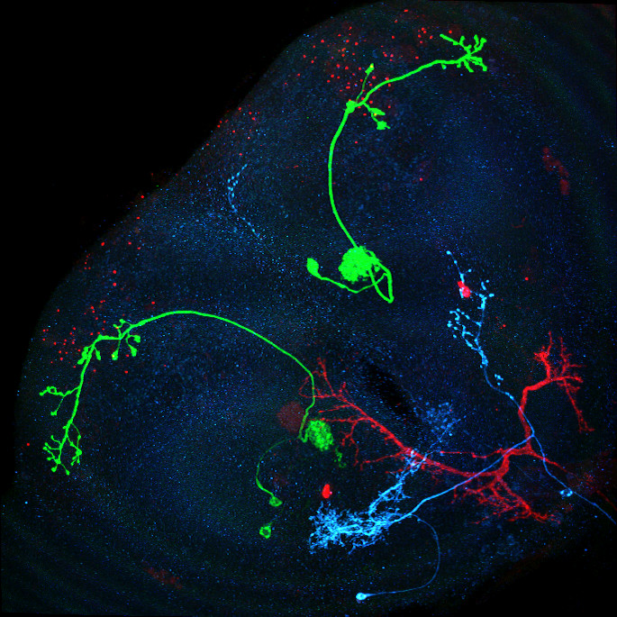
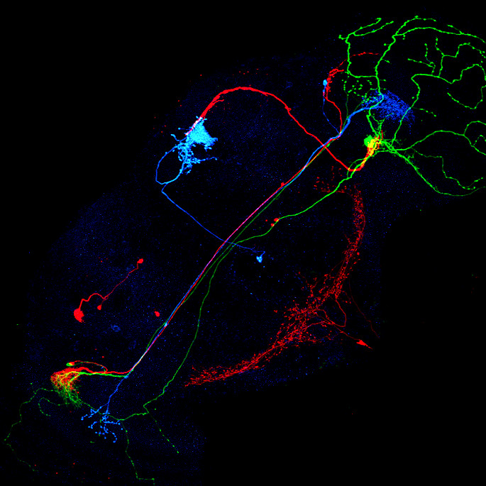
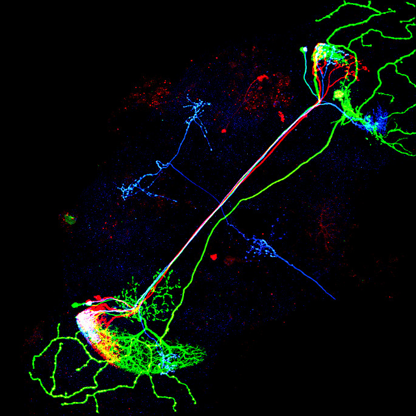
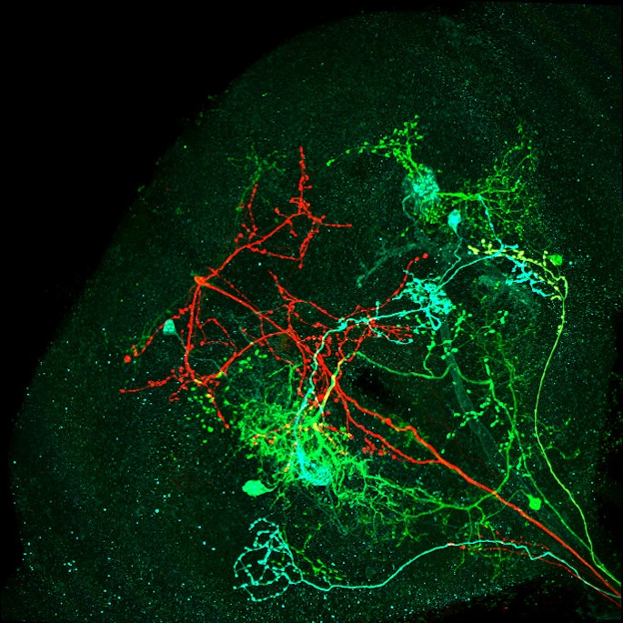
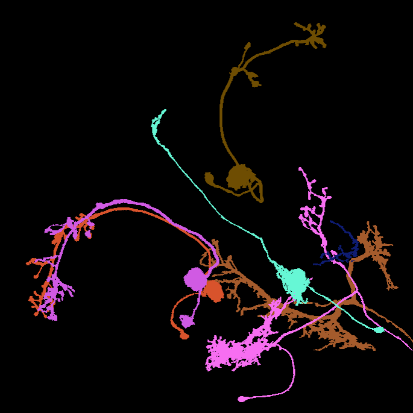
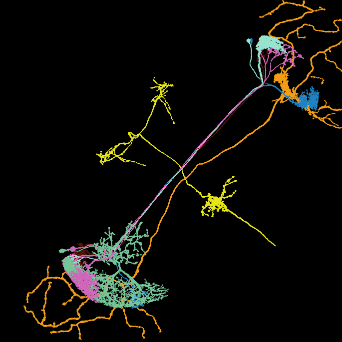
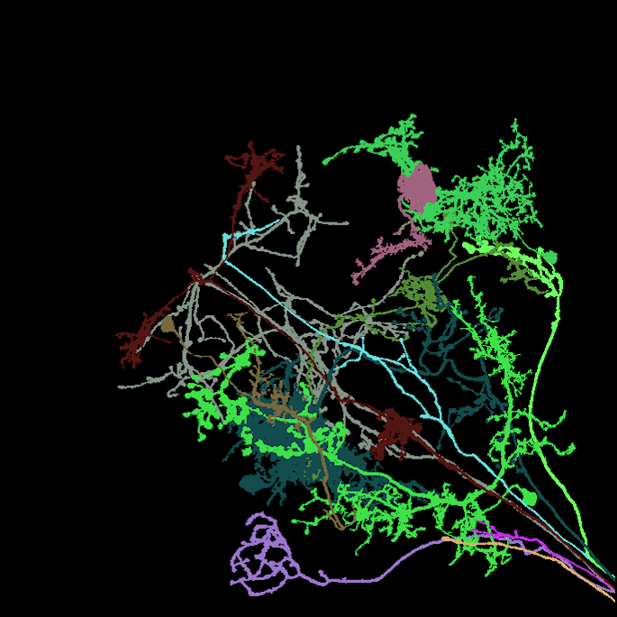

*under construction*


Lisa Mais [](https://orcid.org/0000-0002-9281-2668) ,
Peter Hirsch [](https://orcid.org/0000-0002-2353-5310) ,
Claire Managan [](https://orcid.org/0000-0002-9510-6443) ,
Ramya Kandarpa,
Josef Lorenz Rumberger [](https://orcid.org/0000-0002-7225-7011) ,
Annika Reinke [](https://orcid.org/0000-0003-4363-1876) ,
Lena Maier-Hein [](https://orcid.org/0000-0003-4910-9368) ,
Gudrun Ihrke [](https://orcid.org/0000-0003-4604-735X) ,
Dagmar Kainmueller [](https://orcid.org/0000-0002-9830-2415/)

[[**`Paper`**](https://)] [[**`Project`**](./index)] [[**`Documentation`**](./datasheet)] [[**`Metrics`**](#metrics)] [[**`Leaderboard`**](#leaderboard)] [[**`BibTeX`**](#citation)] [[**`Changelog`**](./changelog)]


<p float="left">




</p>

<p float="left">




</p>
Image: Maximum intensity projection of four example 3d light microscopy images in the top row, their respective ground truth segmentation in the bottom row. The images have an average size of ~400x700x700 pixels, an isotropic resolution of 0.44μm and three color channels.

## Summary

- A new dataset for neuron instance segmentation in 3d multicolor light microscopy data of fruit fly brains
  - 30 completely labeled, that is segmented, images
  - 70 partly segmented images
  - altogether comprising ∼600 expert-labeled neuron instances<br>
	(labeling a single neuron takes between 30min and 4h)
- To the best of our knowledge, the first real-world benchmark dataset for instance segmentation of long thin filamentous objects
- A set of metrics and a novel ranking score for respective meaningful method benchmarking
- An evaluation of a baseline deep learning-based instance segmentation model in terms of the above metrics and score

## Announcements

June 2023: The paper is currently under review


## Abstract

<!-- <div style="text-align: justify"> -->
Neurons imaged with light microscopy (LM) exhibit extremely challenging properties for the task of instance segmentation.
Yet such recordings enable groundbreaking research in neuroscience by allowing joint functional and morphological analysis of brain function on the single cell level.
Segmenting individual neurons in multi-neuron LM recordings is intricate due to the long, thin filamentous and widely branching morphology of individual neurons, the tight interweaving of multiple neurons, and LM-specific imaging characteristics like partial volume effects and uneven illumination.<br>
These challenging properties reflect a key current challenge for deep-learning models across domains, namely to efficiently capture long-range dependencies in the data.
While methodological research on this topic is buzzing in the machine learning community, to date, respective methods are typically benchmarked on synthetic datasets.
To fill this gap, we release the FlyLight Instance Segmentation Benchmark dataset, the first publicly available multi-neuron LM dataset with pixel-wise ground truth.
Together with the data, we define a set of instance segmentation metrics for benchmarking, which we designed to be meaningful with regards to downstream analysis of neuronal structures.
Lastly, we provide a baseline model to kick off a competition that we envision to both advance the field of machine learning regarding methodology for capturing long-range data dependencies, as well as facilitate scientific discovery in basic neuroscience.
<!-- </div> -->


## Dataset documentation:

We provide a detailed documentation of our dataset, following the [Datasheet for Datasets](https://arxiv.org/abs/1803.09010) questionnaire:

*[>> FISBe Datasheet](./datasheet)*

## How to work with the image files

Each sample consists of a single 3d MCFO image of neurons of the fruit fly.
For each image, we provide a pixel-wise instance segmentation for all separable neurons.
Each sample is stored as a separate *zarr* file ("[zarr](https://zarr.readthedocs.io) is a file storage format for chunked, compressed, N-dimensional arrays based on an open-source specification.").
The image data ("raw") and the segmentation ("gt\_instances") are stored as two arrays within a single zarr file.
The segmentation mask for each neuron is stored in a separate channel.
The order of dimensions is CZYX.

We recommend to work in a virtual environment, e.g., by using conda:

```bash
conda create -y -n flylight-env -c conda-forge python=3.9
conda activate flylight-env
```

### How to open *zarr* files

1) Install the python *zarr* package:
```bash
pip install zarr
```

2) Opened a *zarr* file with:

```python
import zarr
raw = zarr.open(<path_to_zarr>, mode='r', path="volumes/raw")
seg = zarr.open(<path_to_zarr>, mode='r', path="volumes/gt_instances")

# optional:
import numpy as np
raw_np = np.array(raw)
```

Zarr arrays are read lazily on-demand.
Many functions that expect numpy arrays also work with zarr arrays.
Optionally, the arrays can also explicitly be converted to numpy arrays.


### How to view *zarr* image files

We recommend to use [*napari*](https://napari.org) to view the image data.

1) Install *napari*:
```bash
pip install "napari[all]"
```

2) Save the following Python script:
```python
import zarr, sys, napari

raw = zarr.load(sys.argv[1], mode='r', path="volumes/raw")
gt = zarr.load(sys.argv[1], mode='r', path="volumes/gt_instances")

viewer = napari.Viewer(ndisplay=3)
for idx, gt in enumerate(gts):
  viewer.add_labels(
    gt, rendering='translucent', blending='additive', name=f'gt_{idx}')
viewer.add_image(raw[0], colormap="red", name='raw_r', blending='additive')
viewer.add_image(raw[1], colormap="green",  name='raw_g', blending='additive')
viewer.add_image(raw[2], colormap="blue",  name='raw_b', blending='additive')
napari.run()
```

3) Execute:
```bash
python <script_name.py> <path-to-file>/R9F03-20181030_62_B5.zarr
```


## Metrics

| Metric         | short description              |
|----------------|--------------------------------|
| S              | average of avF1 and C          |
| avF1           | Multi-Threshold F1 Score       |
| C              | Average ground Truth coverage  |
| C<sub>TP</sub> | Average true positive coverage |
| FS             | Number of false splits         |
| FM             | Number of false merges         |

(for a precise formal definition please see [our paper](https://))


### Note
Following [Metrics reloaded](https://arxiv.org/abs/2206.01653), a metric consists of three steps: localization, matching and computation.
In the localization step some function is used to compute how well each pair of prediction and gt instances are co-localized.
In the matching step a subset of these pairs is selected, resulting in a match of predictions to gt instances.
In the last step, the computation step, the value of the metric is computed based on the quality of the previously computed subset of matched instances.


### Aggregate benchmark score *S*

average of *avF1* and *C*:

*S = 0.5 \* avF1 + 0.5 \* C*


### Multi-threshold F1 score *avF1*
1. localization: *clDice*
   - [*clDice*](https://arxiv.org/abs/2003.07311) measures how much of the centerline of a given *gt* instance is covered by a certain *predicted* instance and vice versa
   - compute *clDice* for all pairs of *predicted* and *gt* instances<br>
   (*dice = 2 \* (precision \* recall) / (precision + recall)*)
2. matching: *greedy*
   - sort all *clDice* scores in descending order
   - match corresponding (pred, gt)-pair if neither has been assigned before (*one-to-one* matching)
3. computation (compute value for metric)
   - derive *TP* (true positives), *FP* (false positives), *FN* (false negatives)
   - compute *F1* for a range of thresholds *th*
	 - for each *th* in *[0.1:0.9:0.1]*:
	   - TP: all *predicted* instances that are assigned to a gt label with *clDice > th*
	   - FP: all unassigned *predicted* instances
	   - FN: all unassigned *gt* instances
	 - compute *F1 = 2TP/(2TP + FP + FN)* for each threshold, across all images.
   - final *avF1* score: average of all *F1* scores


### Average ground truth coverage C

1. localization: *clPrecision*
   - compute *clPrecision* scores for all pairs of *predicted* instances and *gt* instances
2. matching: *greedy*
   - sort all *clDice* scores in descending order
   - match each *predicted* instance to the *gt* instance with the highest *clPrecision* score
   - each *gt* instance can be covered by multiple predictions (*one-to-many* matching)
3. computation
   - average *clRecall* for all *gt* instances and the union of their matched *predictions*<br>
   (to avoid double-counting of pixels with overlapping predictions)


### Average true positive coverage C<sub>TP</sub>

1. localization: *clPrecision*
   - compute *clPrecision* scores for all pairs of *predicted* instances and *gt* instances
2. matching: *greedy*
   - sort all *clDice* scores in descending order
   - match each *predicted* instance to the *gt* instance with the highest *clPrecision* score
   - each *gt* instance can be covered by multiple predictions (*one-to-many* matching)
3. computation
   - compute *clRecall* for all *gt* instances and the union of their matched *predictions*
   - compute average of *clRecall* of all *gt* instances with a minimum coverage of 0.5<br>
   ("true positive instances", *clRecall > 0.5*)


### FS (false splits)

False split errors are predictions that are not *one-to-one* matched to a ground truth (gt) instance but that primarily lie within a gt instance and not the background.

### FM (false merges)

False merge errors count the additional number of gt instances that are covered by a prediction instance with *clRecall > 0.5*, aside from one possibly matched gt instance.


## Baseline

To showcase our new dataset together with our selection of metrics, we provide evaluation results for a baseline method, namely [PatchPerPix](https://github.com/Kainmueller-Lab/PatchPerPix), an instance segmentation method that was designed with some of the challenges in mind that our dataset exhibits.
It intrinsically handles overlapping instances and has the capacity to disentangle thin intertwined structures.
However, it does not model long-range data dependencies, and it can only handle overlaps up to a size threshold.
For detailed information on the model please see [our paper](https://).


## Leaderboard

If you applied your own method to *the FlyLight Instance Segmentation Dataset*, please let us know!
We will add you to the leaderboard.

### Leaderboard *completely* labeled data

(Trained on *completely* labeled data, evaluated on *completely* labeled data and *partly* labeled data combined)

| Method      | S | avF1 | C | C<sub>TP</sub> | FS | FM |
|-------------|---|------|---|---------------|----|----|
| PatchPerPix |   |      |   |               |    |    |
|             |   |      |   |               |    |    |


### Leaderboard *completely+partly* labeled data

(Trained on *completely* labeled and *partly* labeled data combined, evaluated on *completely* labeled data and *partly* labeled data combined)

| Method               | S | avF1 | C | C<sub>TP</sub> | FS | FM |
|----------------------|---|------|---|---------------|----|----|
| PatchPerPix(+partly) |   |      |   |               |    |    |
|                      |   |      |   |               |    |    |


## License

*The FlyLight Instance Segmentation Dataset (FISBe)* is licensed under the
[Creative Commons Attribution 4.0 International (CC BY 4.0) license](https://creativecommons.org/licenses/by/4.0).


## Citation

If you use *The FlyLight Instance Segmentation Dataset* in your research, please use the following BibTeX entry:

```BibTeX
@inproceedings{mais2023_the_flylight_inst_seg_dataset,
  title =	 {The FlyLight Instance Segmentation Dataset},
  author =	 {Lisa Mais and Peter Hirsch and Claire Managan and Ramya
                  Kandarpa and Josef Lorenz Rumberger and Annika Reinke and Lena
                  Maier-Hein and Gudrun Ihrke and Dagmar Kainmueller},
  journal =	 {(in review)},
  year =	 {2023}
}
```

## Acknowledgments

We wish to thank Geoffrey W. Meissner for valuable discussions and the entire FlyLight Project Team for providing this incredible collection of MCFO acquisitions.
This work was co-funded by Helmholtz Imaging.
P.H. was funded by the MDC-NYU exchange program and HFSP grant RGP0021/2018-102. P.H., L.M. and D.K. were supported by the HHMI Janelia Visiting Scientist Program.
VVD Viewer is an open-source software funded by NIH grant R01-GM098151-01.


## Changelog

There have been no changes to the dataset so far.
All future change will be listed [on the changelog page](./changelog).


## Contributing

If you would like to contribute, have encountered any issues or have any suggestions, please [open an issue](https://github.com/Kainmueller-Lab/flylight_inst_seg_dataset/issues "open issue for fhe FlyLight Instance Segmentation Dataset") in this GitHub repository.

All contributions are welcome!
